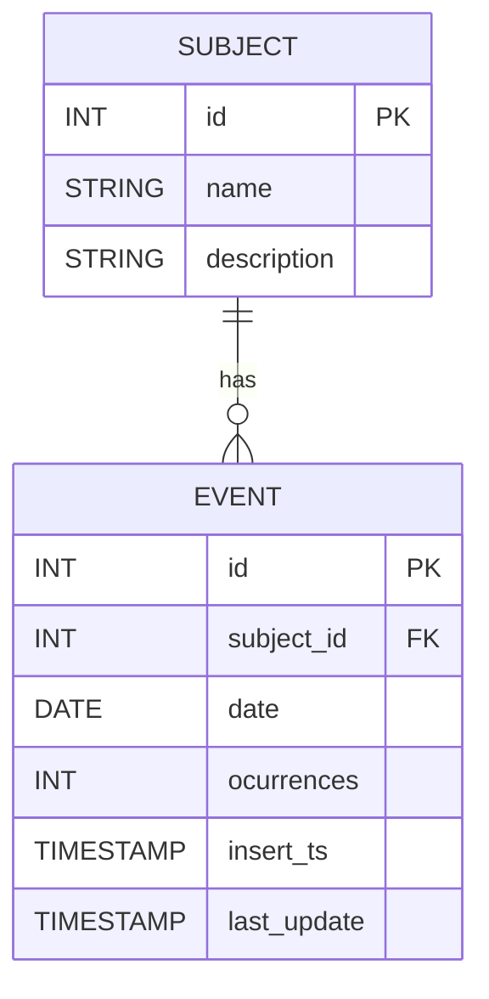

# Event Registration App (Go)

An application built in **Go** to register events, manage their subjects, store occurrences, and generate simple reports. The system uses **PostgreSQL** as its primary database.

---

## 📌 Features

* Register subjects
* Register events linked to subjects
* Store event dates and number of occurrences
* Track creation and last update timestamps
* Generate simple reports based on events and subjects

---

## 🧱 Tech Stack

* **Language:** Go (Golang)
* **Database:** PostgreSQL
* **Architecture:** REST / CLI / Service (adaptable)

---

## 🗄️ Database Schema

The application uses two main entities:

* **Subject** → Represents the topic or category of an event
* **Event** → Represents an occurrence tied to a subject

---

## 📊 Entity Relationship Diagram (ERD)



---

## 🧩 Entity Details

### Subject

| Field       | Type   | Description          |
| ----------- | ------ | -------------------- |
| id          | int    | Primary Key          |
| name        | string | Subject name         |
| description | string | Detailed description |

---

### Event

| Field       | Type      | Description               |
| ----------- | --------- | ------------------------- |
| id          | int       | Primary Key               |
| subject_id  | int       | Foreign Key → Subject(id) |
| date        | date      | Event date                |
| ocurrences  | int       | Number of occurrences     |
| insert_ts   | timestamp | Record creation timestamp |
| last_update | timestamp | Last update timestamp     |

---

## 🔗 Relationships

* One **Subject** can have many **Events**
* Each **Event** belongs to exactly one **Subject**

Relationship:

```
Subject (1) ────────< (N) Event
```

---

## 🚀 Getting Started

### Prerequisites

* Go 1.20+
* PostgreSQL 13+

### Clone the repository

```bash
git clone https://github.com/your-username/event-registration-app.git
cd event-registration-app
```

### Configure environment variables

Follow the `.env-example`, clone it and create your own `.env`

### Run migrations

(You can use tools like `golang-migrate`, `goose`, or custom SQL scripts.)

### Run the application

```bash
go run main.go
```

---

## 📈 Example Reports

Planned simple reports include:

* Events per subject
* Total occurrences by subject
* Events by date range
* Most frequent subjects

---

## 🛠️ Future Improvements

* Authentication & authorization
* Dashboard UI
* Export reports (CSV / PDF)
* Event reminders / notifications

---

## 📄 License

MIT License

---

## 👨‍💻 Author

Your Name Here
